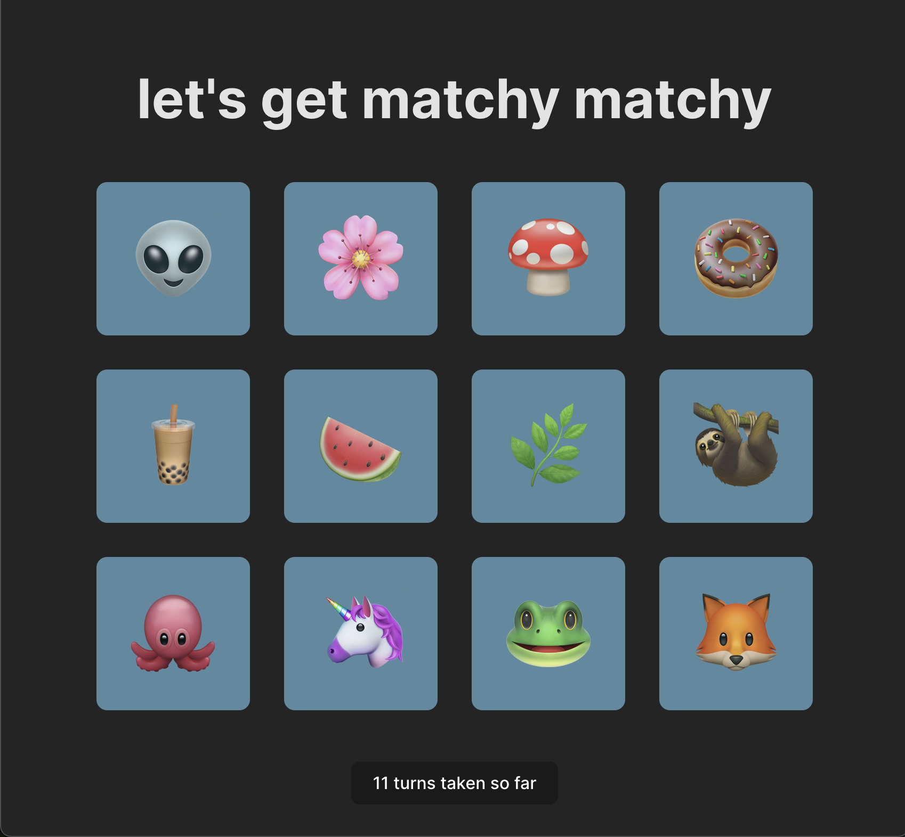
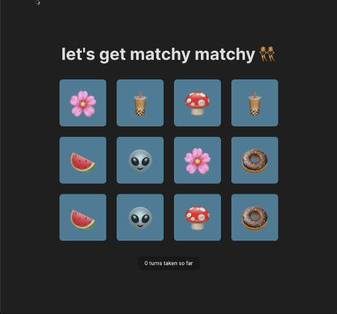

# matchy matchy

✨ A minimalist and nostalgic card-matching game featuring some of my favourite emojis 👾 ✨

# Progress Tracking

Breaking down the process (with pictures!)

## September 11:

1. From an array of `emojis`, created and styled 12 starter cards.
2. Added click handler function calls to each card.
3. For every 2 clicks, 1 turn is taken (2 clicks will eventually represent either matched or mismatched cards). The click handler updates state values (`move` and `turns`) depending on how many times the user has clicked cards.
4. Turns are displayed via state logic beneath the cards.

## October 10:

1. Added a `shuffle` function for randomization of card placement using the [Fisher-Yates Sorting Algorithm](https://www.freecodecamp.org/news/how-to-shuffle-an-array-of-items-using-javascript-or-typescript/). This algorithm is often used to shuffle an array of items, as many of the typical methods associated with arrays (like mapping) follow an algorithm in _sequence_.
2. Appended `cards` array with two matching `emojis` per loop (two at a time) in order to focus on the game's matching logic; emoji pairs to be randomly appended at a later point.

## October 11:

### 🪲🔍 Bug:

On each click, the entire game would reshuffle:

### 🩺 Diagnosing the problem:

This is a state issue. Because React is designed to re-render components on any change of state and the app's state changes with each `card` click (clicks counted to display `turns` taken), the `turns` counter logic was the culprit. The call to the `shuffle` function was originally happening within the component whose state changes on click. This means that the `shuffle` function was being called repeatedly with every click/state change and the cards were re-rendering & shuffling.

### 🧩 The solution:

While there are many potential solutions to this sort of re-rendering issue (React.memo, React.useRef), sometimes the most straightforward solution is to [move logic out of the component](https://stackoverflow.com/questions/66590082/how-to-prevent-re-rendering-of-components-that-have-not-changed). This is also key in moving towards improved [separation of concerns](https://en.wikipedia.org/wiki/Separation_of_concerns#:~:text=In%20computer%20science%2C%20separation%20of,code%20of%20a%20computer%20program.).

Here you can see that the shuffle function still randomizes the placement of the cards when the application is refreshed _and_ the cards stay in place when the aforementioned state change takes place (on each click of a card):

