# matchy matchy

✨ A minimalist and nostalgic card-matching game featuring some of my favourite emojis 👾 ✨

# Progress Tracking

Breaking down the process (with pictures!)

## September 11:

1. From an array of `emojis`, created and styled 12 starter cards.
2. Added click handler function calls to each card.
3. For every 2 clicks, 1 turn is taken (2 clicks will eventually represent either matched or mismatched cards). The click handler updates state values (`move` and `turns`) depending on how many times the user has clicked cards.
4. Turns are displayed via state logic beneath the cards.


## October 10:

1. Added a `shuffle` function for randomization of card placement using the [Fisher-Yates Sorting Algorithm](https://www.freecodecamp.org/news/how-to-shuffle-an-array-of-items-using-javascript-or-typescript/). This algorithm is often used to shuffle an array of items, as many of the typical methods associated with arrays (like mapping) follow an algorithm in _sequence_.
2. Appended `cards` array with two matching `emojis` per loop (two at a time) in order to focus on the game's matching logic; emoji pairs to be randomly appended at a later point.

## October 11:

### 🪲🔍 Bug:

On each click, the entire game would reshuffle:


### 🩺 Diagnosing the problem:

This is a state issue. Because React is designed to re-render components on any change of state and the app's state changes with each `card` click (clicks counted to display `turns` taken), the `turns` counter logic was the culprit. The call to the `shuffle` function was originally happening within the component whose state changes on click. This means that the `shuffle` function was being called repeatedly with every click/state change and the cards were re-rendering & shuffling.

### 🧩 The solution:

While there are many potential solutions to this sort of re-rendering issue (React.memo, React.useRef), sometimes the most straightforward solution is to [move logic out of the component](https://stackoverflow.com/questions/66590082/how-to-prevent-re-rendering-of-components-that-have-not-changed). This is also key in moving towards improved [separation of concerns](https://en.wikipedia.org/wiki/Separation_of_concerns#:~:text=In%20computer%20science%2C%20separation%20of,code%20of%20a%20computer%20program.).

Here you can see that the shuffle function still randomizes the placement of the cards when the application is refreshed _and_ the cards stay in place when the aforementioned state change takes place (on each click of a card):

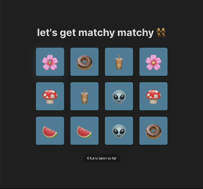&nbsp;

Following this bug fix, I made another call to the `shuffle` function in order to randomize the `emojis` array. This ensures that when they are appended to the `cards` array, we'll have a different assortment of `emojis` for each game:

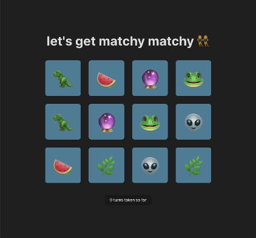

## October 15:

1. Added state management for `selections` (the emojis selected on each turn will populate the `selections` array for comparison and clear out every 2 clicks).
2. Wrote `checkMatch` function to compare card selections and check for a match. As I'm working incrementally, currently this function prints to console either _"It's a match! 🥳"_ or _"Sorry, no match. 😢"_
3. Updated click handler function to use `setSelections` when a card is clicked, updating the `selections` array with the emoji that has just been clicked.
4. Added call to `useEffect` to monitor changes in `selections` state. This ensures that when a comparison between two selected cards is made, both emojis are present in the `selections` array (accounting for React's asynchronous state updates).

## October 17:

Today my focus was to begin addressing the issue of double clicks, meaning: two clicks should not be counted as a match if the user is double clicking the same card. While technically they will have clicked the same emoji twice, their selections should come from two different cards– as in a traditional matching/memory game.

I've opted to compare not only `emojis` but `ids` as well. As each card is assigned a `key` during rendering, I can easily take the cards' `key` values and assign them to an `id` variable in an object representing a `first` or `second` selection. By comparing `ids`, we can account for the double click issue.

I began by typing out what I wanted the object to look like. I will often write out the general structure of an object this way as it helps me to visualize the data as a starting point:

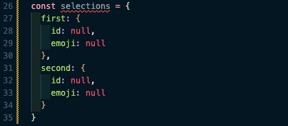&nbsp;

I then refactored the object to reduce the number of lines for better readability:

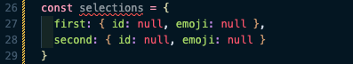&nbsp;

And then, using this object structure, updated the state initialization and corresponding code accordingly:

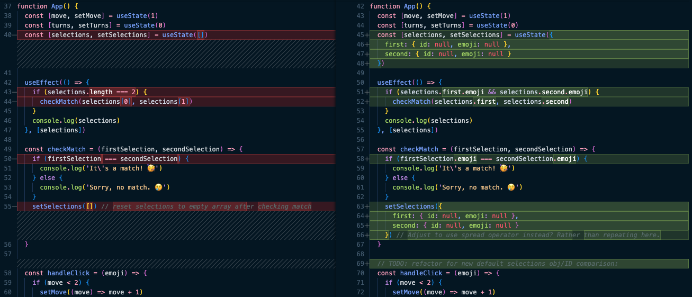&nbsp;

## October 18:

1. Completed yesterday's refactor by passing both `id` and `emoji` values via the click handler for each card.
2. Set up `handleClick` function to receive both of these values.
3. Tested to ensure that the values were printing to the console as expected (`first` and `second` objects should be updated with `id` and `emoji` values; `id` values should be different; `selections.first` and `selections.second` should reset to `null` values following each turn taken):

   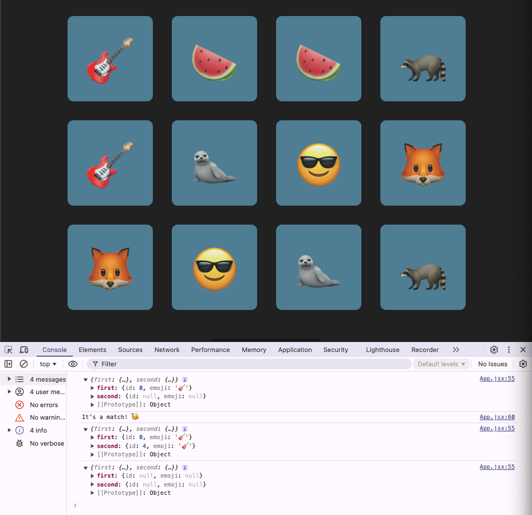

4. Adjusted `handleClick` conditionals to make the code more human-readable. For example: instead of writing `if (move < 2)`, I wrote `if (move === 1)`. Instead of writing `setMove((move) => move + 1)`, I wrote `setMove(2)`.
5. Updated `checkMatch` function to first check the `ids` of selected emojis. If the `ids` for `first` and `second` `selections` are the same: a message prints to indicate that the same card has been selected twice, the `selections` state is reset to `null` values, and function exection ends. User will then be able to take another turn.

   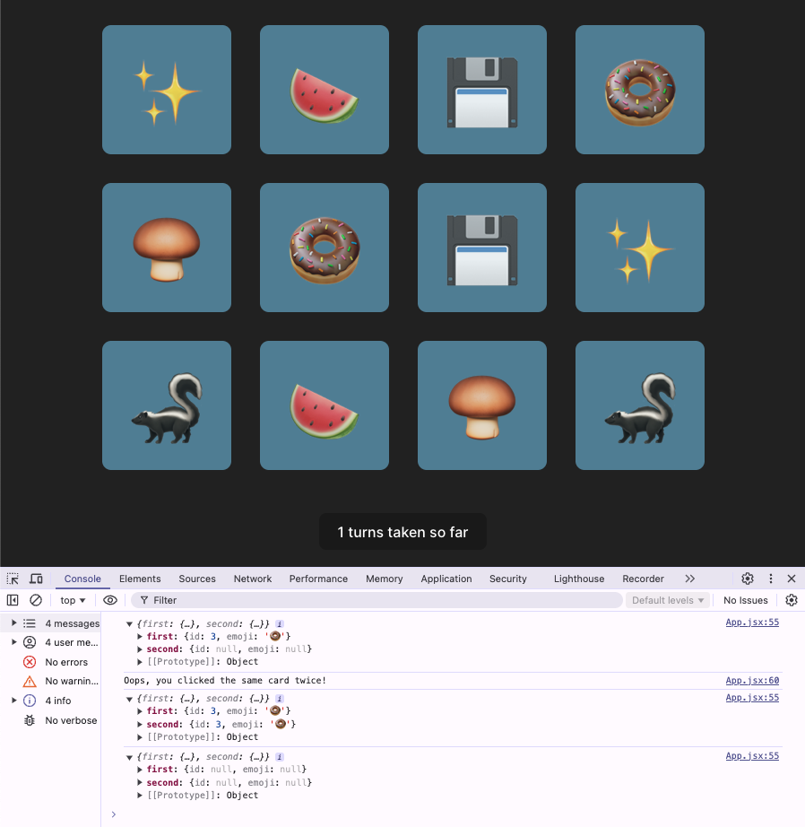

## October 21-23:

1. Added `cards` to state in order to leverage state for managing their visibility:
   ```
   const [cards, setCards] = useState(
    shuffledEmojis.map((emoji, index) => ({
      id: index,
      emoji: emoji,
      matched: false
    }))
   ```
   With that in place, cards/emojis can be displayed dynamically based on a conditional which checks if the `matched` property is `true` or `false`. (If true, the matched cards/emojis should no longer be visible).
2. Began tracking the number of `matches` in both the state of the application and the UI itself so that users can see the number of turns they've taken vs. number of matches made. The state of the match counter is updated via the `checkMatch` function.
3. Since we now have the `cards` in state (re: point 1), I modified the `checkMatch` function to update their `matched` property. For each `card` that has been matched, `matched` will now be set to `true`. Because the app is set up to render cards based on this value, cards/emojis will now disappear when matched.

This (point 3) was done via the `prev` _(previous)_ React pattern. The **TLDR:** `useState` `set` functions (as established at state initialization, ie: `const [cards, setCards] = useState( [...]`) will have access to the _previous_ state via the `set` function.

What this means is that we can copy the entirety of the previous state (`cards`) when we call `setCards` to update the state (typically using the spread operator: `...cards`). We can then add to/update the previous state as needed. You can read more about this in the React documentation [here](https://react.dev/reference/react/useState#updating-state-based-on-the-previous-state). Further discussion about this topic can be found on [Stack Overflow](https://stackoverflow.com/questions/55823296/reactjs-prevstate-in-the-new-usestate-react-hook).

Changes to the `checkMatch` function:

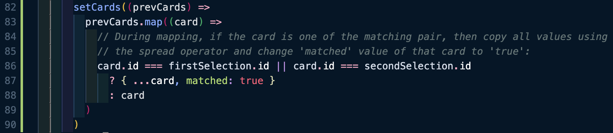&nbsp;

The app in its current state, with emojis disappearing on match and both the turn & match counters functioning:
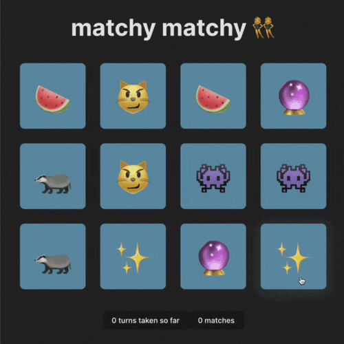

## _CSS NOTES: Notes to be edited_

[YouTube Tutorial](https://www.youtube.com/watch?v=OV8MVmtgmoY&ab_channel=ArjunKhara)

3:36: The main container simply holds all of the elements and determines the size of the card. .thecard holds the two front and back elements and also controls the mouse hover action with the hover pseudoclass. The front element is the front-facing element which shows us the default face. The back element is the reverse side of the card, which shows when a user hovers over the card. If you take away the preserve-3d value, all you get is a reversal of the front side of the card (the back doesn't show). It's easier to visualize this with text in the front of the card.

Sandwich analogy: without preserve-3d, we only flip the top slice. With preserve-3d, we flip the entire sandwich. (What a great visual!!!)

4:48: the backface-visibility: hidden; property (applied to "thefront" and "theback" both) controls the reverse side of just that div. Keeping either visible will conflict with the 3D layers and cause a flicker in the animation.

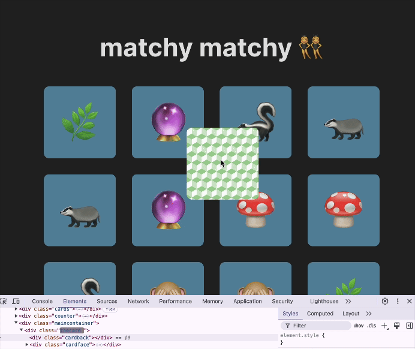

CSS Commit Nov 18: Add notes re: _grid-template-columns: repeat(4, 7rem);_

Also re:
_.maincontainer {
position: static;
}_

https://www.w3schools.com/css/css_positioning.asp

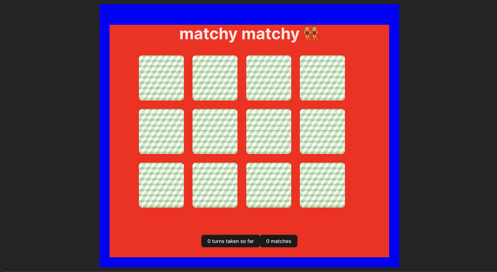

## Nov 25-29

Notes to be added:

- Confetti
- Testing refresher
- Deployment challenges

## Dec 2

Building a reset function to be triggered after click to reset game (initially: after confetti):

1. Reset state variables
2. Shuffle deck to reinitialize emojis in the deck
3. Reset counters: turns, matches, selections.
4. Bundle all of these things into a single function.

# Dec 3

- Fixed an issue where a second array of 12 cards was being rendered (initial array was not cleared/reset). The fix: give the cards their own dedicated state, reset with `shuffleCards` function at end of game as needed.
- Fixed an issue where, after the above fix, confetti was being triggered on an endless loop. The fix: `useEffect` now checks `if ((matches * 2) === cards.length)`. `useEffect` essentially allows us to _React_ to changes in the state of the game. In the code block, `useEffect` is "watching" for `matches` and `cards`, and whenever either chamges, React checks the condition specified.

The syntax, per React documentation, is: `useEffect(setup, dependencies?)`. The docs describe the hook as "[synchronizing] a component with an external system" (i.e. a non-React component).
[React docs](https://react.dev/reference/react/useEffect)

Before this fix, confetti was being triggered repeatedly because its logic didn't depend on the game's state. The logic was not tied to or dependent upon state updates. Prior to giving `cards` their own dedicated state, the confetti was triggered as expected. My suspicion is that the confetti logic started malfunctioning because the `cards` state was not fully cleared/reset within the React lifecycle (which can behave in unexpected ways, to us humans). The condition for triggering confetti (`(matches * 2) === cards.length`) depends on an up-to-date state of the game, and without running `useEffect`, React does not know when to check the conditional again.

Again: `useEffect` watches for changes in specific variables (dependencies, per the syntax/docs), and whenever those variables change, it runs the effect (in this case, checking a condition and executing `handleCelebrate` if the condition is met).

### Current state of the game:

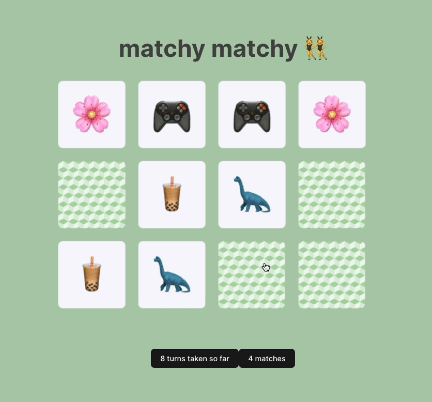
